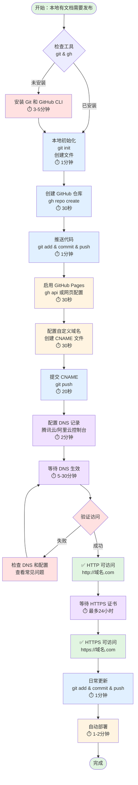
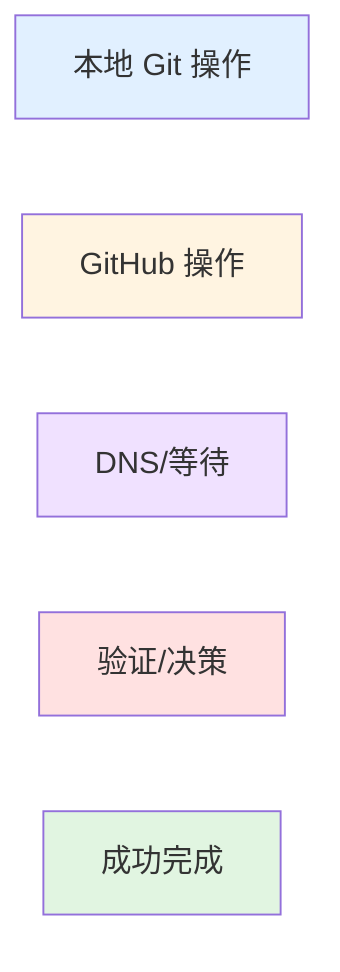
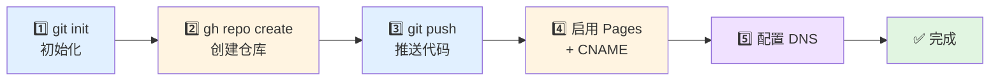

# GitHub 仓库到自定义域名 - 完整操作流程

> 从零开始，将本地文档发布为自定义域名网站的完整指南

---

## 📋 目录

1. [流程总览](#流程总览)
2. [前置准备](#前置准备)
3. [本地 Git 仓库初始化](#本地-git-仓库初始化)
4. [GitHub 仓库创建](#github-仓库创建)
5. [推送代码到 GitHub](#推送代码到-github)
6. [配置 GitHub Pages](#配置-github-pages)
7. [配置自定义域名](#配置自定义域名)
8. [DNS 配置](#dns-配置)
9. [验证和测试](#验证和测试)
10. [后续更新流程](#后续更新流程)
11. [常见问题](#常见问题)

---

## 流程总览

### 完整流程图



### 流程阶段说明

| 阶段 | 操作环境 | 预计耗时 | 难度 | 说明 |
|------|---------|---------|------|------|
| 🔧 **前置准备** | 本地命令行 | 0-5分钟 | ⭐ | 安装工具（仅首次需要） |
| 💻 **本地操作** | 本地命令行 | 2分钟 | ⭐⭐ | Git初始化、创建文件 |
| 🌐 **GitHub配置** | CLI/网页 | 2分钟 | ⭐⭐ | 创建仓库、启用Pages |
| 📤 **代码推送** | 本地命令行 | 1分钟 | ⭐⭐ | 推送到GitHub |
| 🌍 **DNS配置** | 云服务控制台 | 2分钟 | ⭐⭐ | 添加DNS记录 |
| ⏳ **等待生效** | - | 5-30分钟 | - | DNS全球传播 |
| ✅ **验证测试** | 浏览器/命令行 | 2分钟 | ⭐ | 确认可访问 |
| **总计（首次）** | - | **15-50分钟** | - | 包含等待时间 |
| **总计（实际操作）** | - | **10分钟** | - | 不含等待时间 |

### 颜色图例



- 🔵 **蓝色**：本地 Git 操作
- 🟡 **黄色**：GitHub 平台操作
- 🟣 **紫色**：DNS 配置和等待
- 🔴 **红色**：检查和决策节点
- 🟢 **绿色**：成功完成状态

### 快速开始（5步核心流程）

如果你已经熟悉工具，只需关注这5个核心步骤：



**预计总时间**：5-6 分钟（不含 DNS 等待）

---

## 前置准备

### 需要的工具

```bash
# 1. 检查 Git 是否已安装
git --version
# 如果未安装: brew install git (macOS)

# 2. 检查 GitHub CLI 是否已安装
gh --version
# 如果未安装: brew install gh (macOS)

# 3. 登录 GitHub CLI
gh auth login
# 按提示选择：GitHub.com → HTTPS → Login with browser
```

### 需要准备的信息

- ✅ GitHub 账号（已有：chituhouse）
- ✅ 要发布的文档文件
- ✅ 已购买的域名（本例：mistprism.cloud）
- ✅ 域名在哪个服务商（本例：腾讯云）

---

## 本地 Git 仓库初始化

### 操作步骤

```bash
# 1. 进入项目目录
cd /path/to/your/project

# 2. 初始化 Git 仓库
git init

# 3. 配置主分支名称（推荐使用 main）
git branch -M main

# 4. 配置 Git 用户信息（如果是首次使用）
git config --global user.name "Your Name"
git config --global user.email "your.email@example.com"

# 5. 创建 .gitignore 文件（排除不需要提交的文件）
cat > .gitignore <<EOF
# 会话历史（敏感信息）
.claude/history/
.claude/*.db
.claude/*.db-*

# 系统文件
.DS_Store

# 临时文件
*.tmp
*.temp
*~

# 编辑器配置
.vscode/
.idea/
EOF

# 6. 创建 README.md（仓库说明）
cat > README.md <<EOF
# 项目名称

项目描述

## 文档列表

- [文档1](文档1.md)
- [文档2](文档2.md)

## 贡献

欢迎贡献！

---

*维护者: [@你的GitHub用户名](https://github.com/你的用户名)*
EOF
```

### 关键点说明

| 操作 | 作用 | 是否必需 |
|------|------|---------|
| `git init` | 创建本地Git仓库 | ✅ 必需 |
| `git branch -M main` | 设置主分支名为main | ⭐ 推荐 |
| `.gitignore` | 排除敏感/临时文件 | ⭐ 推荐 |
| `README.md` | 仓库说明文档 | ⭐ 推荐 |

---

## GitHub 仓库创建

### 方案一：使用 GitHub CLI（推荐）

```bash
# 在项目目录执行
gh repo create 仓库名称 \
  --public \
  --description "仓库描述" \
  --clone=false

# 示例：
gh repo create dev-guides \
  --public \
  --description "开发指南集合 - Development Guides Collection" \
  --clone=false

# 输出示例：
# ✓ Created repository chituhouse/dev-guides on GitHub
# https://github.com/chituhouse/dev-guides
```

### 方案二：使用 GitHub 网页（传统方式）

1. **访问 GitHub**
   - 打开浏览器，访问 https://github.com
   - 登录你的账号

2. **创建新仓库**
   - 点击右上角 `+` → `New repository`
   - 填写仓库信息：
     - Repository name: `dev-guides`
     - Description: `开发指南集合`
     - Public/Private: 选择 `Public`
     - ❌ **不要勾选** "Add a README file"
     - ❌ **不要选择** .gitignore 模板
     - ❌ **不要选择** License
   - 点击 `Create repository`

3. **复制仓库地址**
   - 创建成功后会看到仓库地址
   - 复制 HTTPS 地址，例如：
     ```
     https://github.com/chituhouse/dev-guides.git
     ```

### 对比说明

| 方式 | 优点 | 缺点 |
|------|------|------|
| GitHub CLI | 快速、命令行操作、可脚本化 | 需要安装CLI |
| 网页操作 | 可视化、直观 | 步骤较多、需要切换浏览器 |

---

## 推送代码到 GitHub

### 完整操作流程

```bash
# 1. 添加远程仓库地址
git remote add origin https://github.com/你的用户名/仓库名.git

# 示例：
git remote add origin https://github.com/chituhouse/dev-guides.git

# 2. 验证远程地址
git remote -v
# 输出：
# origin  https://github.com/chituhouse/dev-guides.git (fetch)
# origin  https://github.com/chituhouse/dev-guides.git (push)

# 3. 暂存所有文件
git add .

# 或者选择性添加文件
git add README.md .gitignore 文档1.md 文档2.md

# 4. 查看暂存状态
git status
# 输出示例：
# On branch main
# Changes to be committed:
#   new file:   README.md
#   new file:   .gitignore
#   new file:   文档.md

# 5. 创建提交
git commit -m "Initial commit: Add project documentation"

# 或使用详细的提交信息
git commit -m "$(cat <<'EOF'
Initial commit: Add comprehensive documentation

- Add README.md for repository overview
- Add .gitignore to exclude sensitive files
- Add documentation files

Co-Authored-By: Your Name <your.email@example.com>
EOF
)"

# 6. 推送到 GitHub
git push -u origin main

# 输出示例：
# Enumerating objects: 5, done.
# Counting objects: 100% (5/5), done.
# Writing objects: 100% (5/5), 1.23 KiB | 1.23 MiB/s, done.
# Total 5 (delta 0), reused 0 (delta 0)
# To https://github.com/chituhouse/dev-guides.git
#  * [new branch]      main -> main
# Branch 'main' set up to track remote branch 'main' from 'origin'.
```

### 命令详解

| 命令 | 作用 | 说明 |
|------|------|------|
| `git remote add origin <url>` | 添加远程仓库 | origin 是远程仓库的别名 |
| `git add .` | 暂存所有修改 | `.` 表示当前目录所有文件 |
| `git add 文件名` | 暂存指定文件 | 可以多次执行添加多个文件 |
| `git status` | 查看状态 | 查看哪些文件被修改/暂存 |
| `git commit -m "消息"` | 创建提交 | 保存当前暂存的修改 |
| `git push -u origin main` | 推送并关联分支 | `-u` 设置上游分支，以后只需 `git push` |

### 常用 Git 命令速查

```bash
# 查看提交历史
git log --oneline

# 查看文件差异
git diff

# 撤销工作区修改
git checkout -- 文件名

# 取消暂存
git reset HEAD 文件名

# 修改上次提交信息
git commit --amend

# 查看远程仓库信息
git remote show origin
```

---

## 配置 GitHub Pages

### 方案一：使用 GitHub CLI（推荐）

```bash
# 启用 GitHub Pages
echo '{"source":{"branch":"main","path":"/"}}' | \
  gh api repos/你的用户名/仓库名/pages -X POST --input -

# 示例：
echo '{"source":{"branch":"main","path":"/"}}' | \
  gh api repos/chituhouse/dev-guides/pages -X POST --input -

# 成功输出示例：
# {
#   "url": "https://api.github.com/repos/chituhouse/dev-guides/pages",
#   "status": "built",
#   "cname": null,
#   "custom_404": false,
#   "html_url": "https://chituhouse.github.io/dev-guides/",
#   ...
# }
```

### 方案二：使用 GitHub 网页

1. **进入仓库设置**
   - 访问你的仓库页面
   - 点击 `Settings`（设置）标签

2. **配置 Pages**
   - 在左侧菜单找到 `Pages`
   - 在 `Source` 部分：
     - Branch: 选择 `main`
     - Folder: 选择 `/ (root)`
   - 点击 `Save`

3. **等待部署**
   - 页面会显示："Your site is ready to be published at..."
   - 等待 1-2 分钟
   - 刷新页面，看到："Your site is published at..."

### 验证 GitHub Pages

```bash
# 方法 1: 使用 curl 测试
curl -I https://你的用户名.github.io/仓库名/

# 示例：
curl -I https://chituhouse.github.io/dev-guides/

# 方法 2: 浏览器访问
# 直接在浏览器打开：
# https://chituhouse.github.io/dev-guides/
```

### GitHub Pages 配置项说明

| 选项 | 说明 | 推荐值 |
|------|------|--------|
| Source Branch | 部署哪个分支 | `main` |
| Folder | 部署哪个目录 | `/ (root)` 或 `/docs` |
| Custom domain | 自定义域名 | 留空（下一步配置） |
| Enforce HTTPS | 强制 HTTPS | ✅ 勾选（配置域名后自动） |

---

## 配置自定义域名

### 步骤一：创建 CNAME 文件

```bash
# 在项目根目录创建 CNAME 文件
echo "你的域名.com" > CNAME

# 示例：
echo "mistprism.cloud" > CNAME

# 验证文件内容
cat CNAME
# 输出：mistprism.cloud
```

### 步骤二：提交并推送

```bash
# 1. 暂存 CNAME 文件
git add CNAME

# 2. 提交
git commit -m "Add custom domain configuration"

# 3. 推送到 GitHub
git push

# 输出示例：
# To https://github.com/chituhouse/dev-guides.git
#    abc1234..def5678  main -> main
```

### 步骤三：在 GitHub 配置自定义域名（可选）

虽然 CNAME 文件已经足够，但建议在网页上也配置一次：

1. **访问仓库设置**
   - Settings → Pages

2. **配置 Custom domain**
   - 在 `Custom domain` 输入框填入：`mistprism.cloud`
   - 点击 `Save`

3. **等待 DNS 检查**
   - GitHub 会检查 DNS 配置
   - 显示 "DNS check in progress"
   - 配置 DNS 后会变成 "DNS check successful"

### CNAME 文件规则

```bash
# ✅ 正确格式
mistprism.cloud

# ✅ 支持子域名
docs.mistprism.cloud

# ❌ 错误格式（不要包含协议）
https://mistprism.cloud
http://mistprism.cloud

# ❌ 错误格式（不要包含路径）
mistprism.cloud/docs

# ❌ 错误格式（不要包含端口）
mistprism.cloud:80

# ❌ 错误格式（只能有一行，不能有多个域名）
mistprism.cloud
www.mistprism.cloud
```

---

## DNS 配置

### 腾讯云 DNS 配置（详细步骤）

#### 1. 登录控制台

```
访问: https://console.cloud.tencent.com/cns
或: 腾讯云控制台 → 云产品 → DNS解析 DNSPod
```

#### 2. 找到域名

- 在域名列表中找到 `mistprism.cloud`
- 点击域名或右侧的 `解析` 按钮

#### 3. 添加 CNAME 记录（方案一 - 推荐）

点击 `添加记录`，填写以下信息：

| 字段 | 值 | 说明 |
|------|-----|------|
| **记录类型** | `CNAME` | 下拉选择 |
| **主机记录** | `@` | 代表根域名 mistprism.cloud |
| **记录值** | `chituhouse.github.io` | 你的 GitHub Pages 地址 |
| **TTL** | `600` | 10分钟，方便测试 |
| **MX优先级** | - | CNAME 不需要 |

点击 `保存`

再次点击 `添加记录`，添加 www 子域名：

| 字段 | 值 | 说明 |
|------|-----|------|
| **记录类型** | `CNAME` | 下拉选择 |
| **主机记录** | `www` | 代表 www.mistprism.cloud |
| **记录值** | `chituhouse.github.io` | 你的 GitHub Pages 地址 |
| **TTL** | `600` | 10分钟 |

#### 4. 添加 A 记录（方案二 - 备选）

如果 CNAME 记录冲突（例如已有其他记录），使用 A 记录：

添加 4 条 A 记录（GitHub Pages 的 IP 地址）：

| 记录类型 | 主机记录 | 记录值 | TTL |
|---------|---------|--------|-----|
| A | @ | `185.199.108.153` | 600 |
| A | @ | `185.199.109.153` | 600 |
| A | @ | `185.199.110.153` | 600 |
| A | @ | `185.199.111.153` | 600 |

添加 www 的 CNAME：

| 记录类型 | 主机记录 | 记录值 | TTL |
|---------|---------|--------|-----|
| CNAME | www | `chituhouse.github.io` | 600 |

### 阿里云 DNS 配置

1. **登录控制台**
   ```
   访问: https://dns.console.aliyun.com
   ```

2. **找到域名**
   - 点击域名的 `解析设置`

3. **添加记录**
   - 点击 `添加记录`
   - 配置与腾讯云相同

### Cloudflare DNS 配置

1. **登录 Cloudflare**
   ```
   访问: https://dash.cloudflare.com
   ```

2. **选择域名**
   - 点击你的域名

3. **DNS 设置**
   - 左侧菜单 → DNS → Records
   - 点击 `Add record`
   - Type: `CNAME`
   - Name: `@`
   - Target: `chituhouse.github.io`
   - Proxy status: 🟠 DNS only（关闭代理，否则 GitHub 无法验证）
   - TTL: Auto

### DNS 记录类型对比

| 类型 | 用途 | 优点 | 缺点 |
|------|------|------|------|
| **CNAME** | 域名别名 | 配置简单，IP变化自动更新 | 根域名可能不支持（部分DNS） |
| **A** | 直接指向IP | 兼容性好，根域名支持 | IP变化需手动更新 |
| **AAAA** | IPv6地址 | 支持IPv6 | 需要配合A记录 |

### DNS 配置检查清单

```bash
# 1. 检查记录是否添加成功（腾讯云控制台）
# 在记录列表中应该看到：
# 类型   主机记录   记录值                 状态
# CNAME  @         chituhouse.github.io   正常
# CNAME  www       chituhouse.github.io   正常

# 2. 本地验证（终端执行）
dig mistprism.cloud CNAME
dig www.mistprism.cloud CNAME

# 或使用 nslookup
nslookup mistprism.cloud
nslookup www.mistprism.cloud
```

---

## 验证和测试

### 1. DNS 传播检查

#### 本地检查（5-10 分钟后）

```bash
# 方法1: 使用 dig
dig mistprism.cloud

# 期望输出：
# ;; ANSWER SECTION:
# mistprism.cloud.  600  IN  CNAME  chituhouse.github.io.
# chituhouse.github.io.  3600  IN  A  185.199.108.153

# 方法2: 使用 nslookup
nslookup mistprism.cloud

# 期望输出：
# Non-authoritative answer:
# mistprism.cloud  canonical name = chituhouse.github.io.
# Name:    chituhouse.github.io
# Address: 185.199.108.153

# 方法3: 使用 host
host mistprism.cloud

# 期望输出：
# mistprism.cloud is an alias for chituhouse.github.io.
# chituhouse.github.io has address 185.199.108.153
```

#### 在线检查工具

```bash
# 全球 DNS 传播检查
https://www.whatsmydns.net/#CNAME/mistprism.cloud

# DNS 查询工具
https://toolbox.googleapps.com/apps/dig/#CNAME/mistprism.cloud

# 中国地区 DNS 检查
https://tool.chinaz.com/dns/?type=1&host=mistprism.cloud
```

### 2. HTTP 访问测试

```bash
# 测试 HTTP 访问
curl -I http://mistprism.cloud

# 期望输出（部分）：
# HTTP/1.1 200 OK
# Server: GitHub.com
# Content-Type: text/html; charset=utf-8
# ...

# 测试完整内容
curl http://mistprism.cloud

# 测试 www 子域名
curl -I http://www.mistprism.cloud
```

### 3. HTTPS 测试（24小时后）

```bash
# 测试 HTTPS 访问
curl -I https://mistprism.cloud

# 检查 SSL 证书
openssl s_client -connect mistprism.cloud:443 -servername mistprism.cloud

# 或使用在线工具
https://www.ssllabs.com/ssltest/analyze.html?d=mistprism.cloud
```

### 4. 浏览器验证

```bash
# 依次访问以下URL，确保都能正常访问：

1. http://mistprism.cloud
2. http://www.mistprism.cloud
3. https://mistprism.cloud (24小时后)
4. https://www.mistprism.cloud (24小时后)

# 预期行为：
# - HTTP 能立即访问（DNS生效后）
# - HTTPS 需要等待证书签发（最多24小时）
# - www 应该能访问（如果配置了CNAME）
```

### 验证清单

| 检查项 | 命令 | 预期结果 | 等待时间 |
|--------|------|---------|---------|
| DNS记录 | `dig mistprism.cloud` | 返回 CNAME 或 A 记录 | 5-30分钟 |
| HTTP访问 | `curl -I http://mistprism.cloud` | 200 OK | DNS生效后 |
| HTTPS访问 | `curl -I https://mistprism.cloud` | 200 OK | 24小时内 |
| 内容显示 | 浏览器访问 | 看到文档内容 | DNS生效后 |

---

## 后续更新流程

配置完成后，以后更新内容只需简单的 Git 操作：

### 更新文档内容

```bash
# 1. 编辑文档
vim Git完全使用指南.md
# 或使用任何编辑器修改文件

# 2. 查看修改
git status
git diff

# 3. 暂存修改
git add Git完全使用指南.md
# 或添加所有修改: git add .

# 4. 提交
git commit -m "更新Git指南：添加分支管理章节"

# 5. 推送到GitHub
git push

# 6. 等待自动部署（1-2分钟）
# GitHub Pages 会自动重新构建并部署
```

### 添加新文档

```bash
# 1. 创建新文档
cat > Docker使用指南.md <<EOF
# Docker 使用指南
...
EOF

# 2. 更新 README.md（添加链接）
vim README.md
# 在文档列表添加: - [Docker使用指南](Docker使用指南.md)

# 3. 提交并推送
git add Docker使用指南.md README.md
git commit -m "添加Docker使用指南"
git push
```

### 查看部署状态

```bash
# 方法1: 查看 GitHub Actions
gh run list --repo chituhouse/dev-guides

# 方法2: 网页查看
# 访问: https://github.com/chituhouse/dev-guides/actions

# 方法3: 查看部署日志
gh run view --repo chituhouse/dev-guides
```

### 快速更新脚本

创建一个便捷脚本 `update.sh`：

```bash
#!/bin/bash
# 快速更新并部署

# 检查是否有修改
if [ -z "$(git status --porcelain)" ]; then
    echo "没有需要提交的修改"
    exit 0
fi

# 显示修改内容
echo "📝 已修改的文件："
git status --short

# 添加所有修改
git add .

# 提交信息
read -p "📝 输入提交信息: " COMMIT_MSG
if [ -z "$COMMIT_MSG" ]; then
    COMMIT_MSG="更新文档内容"
fi

git commit -m "$COMMIT_MSG

🤖 自动提交脚本

Co-Authored-By: $(git config user.name) <$(git config user.email)>"

# 推送
echo "🚀 推送到 GitHub..."
git push

echo "✅ 完成！等待 1-2 分钟后访问："
echo "   https://mistprism.cloud"
```

使用方法：

```bash
# 添加执行权限
chmod +x update.sh

# 以后更新时直接运行
./update.sh
```

---

## 常见问题

### Q1: DNS 配置后访问显示 404

**可能原因**：
1. GitHub Pages 还在构建中
2. CNAME 文件配置错误
3. DNS 还未完全生效

**解决方法**：
```bash
# 1. 检查 CNAME 文件内容
cat CNAME
# 应该只有域名，没有其他内容

# 2. 检查 GitHub Pages 构建状态
gh run list --repo 你的用户名/仓库名

# 3. 等待 5-10 分钟后重试

# 4. 强制清除浏览器缓存
# Chrome: Cmd+Shift+R (Mac) 或 Ctrl+Shift+R (Windows)
```

### Q2: HTTPS 访问失败

**可能原因**：
SSL 证书还未签发（需要 24 小时）

**解决方法**：
```bash
# 1. 先用 HTTP 确认网站可以访问
curl -I http://mistprism.cloud

# 2. 检查 GitHub Pages 设置
# Settings → Pages → Enforce HTTPS（应该是勾选状态）

# 3. 等待 24 小时后再试

# 4. 查看证书状态
# 浏览器访问 http://mistprism.cloud
# GitHub 会显示："HTTPS certificate is being provisioned"
```

### Q3: DNS 检查失败

**GitHub 显示**: "DNS check failed"

**解决方法**：
```bash
# 1. 验证 DNS 记录是否正确
dig mistprism.cloud CNAME

# 2. 如果返回正确的 CNAME 记录，等待传播
# DNS 全球传播可能需要 48 小时

# 3. 如果长时间未生效，尝试：
# - 清除 CNAME 文件重新创建
# - 在 GitHub Settings → Pages 重新保存域名
# - 检查域名是否有其他冲突的记录（如 A 记录指向其他 IP）
```

### Q4: www 子域名无法访问

**解决方法**：
```bash
# 确保添加了 www 的 CNAME 记录
dig www.mistprism.cloud CNAME

# 应该返回：
# www.mistprism.cloud. 600 IN CNAME chituhouse.github.io.

# 如果没有，在 DNS 控制台添加：
# 类型: CNAME
# 主机记录: www
# 记录值: chituhouse.github.io
```

### Q5: 推送时要求输入用户名密码

**原因**: 使用了 HTTPS 而不是 SSH，或凭证过期

**解决方法**：
```bash
# 方案1: 使用 GitHub CLI 认证
gh auth login

# 方案2: 配置凭证缓存
git config --global credential.helper store
# 下次推送时输入一次用户名和 Personal Access Token

# 方案3: 改用 SSH（推荐）
# 1. 生成 SSH 密钥
ssh-keygen -t ed25519 -C "your.email@example.com"

# 2. 添加到 GitHub
# 复制公钥内容
cat ~/.ssh/id_ed25519.pub
# 在 GitHub: Settings → SSH and GPG keys → New SSH key

# 3. 修改远程地址为 SSH
git remote set-url origin git@github.com:你的用户名/仓库名.git
```

### Q6: 如何更换域名？

```bash
# 1. 修改 CNAME 文件
echo "新域名.com" > CNAME

# 2. 提交并推送
git add CNAME
git commit -m "更换域名为 新域名.com"
git push

# 3. 在 DNS 控制台配置新域名
# 按照 DNS 配置章节操作

# 4. 在 GitHub Settings → Pages 更新域名
# 输入新域名并保存

# 5. 等待 DNS 生效和证书签发
```

### Q7: 如何回滚到之前的版本？

```bash
# 1. 查看提交历史
git log --oneline

# 2. 找到要回滚的提交 ID（例如 abc1234）
git log --oneline -10

# 3. 方法1: 创建新提交回滚（推荐）
git revert abc1234

# 4. 方法2: 硬回滚（谨慎使用）
git reset --hard abc1234
git push --force

# 5. 方法3: 恢复单个文件
git checkout abc1234 -- 文件名.md
git commit -m "恢复文件到之前版本"
git push
```

### Q8: 如何添加多个域名？

**GitHub Pages 限制**: 只支持一个自定义域名

**解决方案**: 在 DNS 层做跳转

```bash
# 场景: 同时支持 mistprism.com 和 mistprism.cn

# 1. CNAME 文件只写主域名
echo "mistprism.com" > CNAME

# 2. 在 DNS 控制台配置主域名
# mistprism.com → CNAME → chituhouse.github.io

# 3. 配置第二个域名跳转
# mistprism.cn → URL 转发 → https://mistprism.com
# (腾讯云: DNS解析 → URL转发)
```

### Q9: 如何查看访问统计？

GitHub Pages 本身不提供统计，可以集成第三方工具：

```bash
# 方案1: Google Analytics
# 在 HTML 文件中添加 GA 代码

# 方案2: 简单的访客统计
# 使用 GitHub 提供的 Traffic 数据
# 仓库页面 → Insights → Traffic

# 方案3: 使用统计服务
# - 不蒜子（busuanzi）: 简单的访客统计
# - 百度统计 / 友盟统计
```

### Q10: 文件名包含中文/空格怎么办?

```bash
# Git 可以处理中文文件名，但建议：

# 方法1: 配置 Git 显示中文
git config --global core.quotepath false

# 方法2: 使用引号包裹文件名
git add "Git完全使用指南.md"
git add "文件 名有空格.md"

# 方法3: 在浏览器中访问需要 URL 编码
# Git完全使用指南.md → Git%E5%AE%8C%E5%85%A8%E4%BD%BF%E7%94%A8%E6%8C%87%E5%8D%97.md

# 最佳实践：
# - 中文文件名可以用，但 URL 会很长
# - README.md 等关键文件用英文
# - 内容可以是中文，文件名建议英文+中文混合
```

---

## 完整命令速查表

### Git 基础操作

```bash
# 初始化
git init
git branch -M main

# 暂存和提交
git add .
git add 文件名
git commit -m "提交信息"
git push

# 查看状态
git status
git log --oneline
git diff

# 远程操作
git remote add origin <url>
git remote -v
git push -u origin main
```

### GitHub CLI 操作

```bash
# 认证
gh auth login
gh auth status

# 仓库操作
gh repo create 仓库名 --public --description "描述"
gh repo view
gh repo list

# Pages 操作
echo '{"source":{"branch":"main","path":"/"}}' | \
  gh api repos/用户名/仓库名/pages -X POST --input -

# 查看部署
gh run list
gh run view
```

### DNS 检查

```bash
# DNS 查询
dig 域名
dig 域名 CNAME
nslookup 域名
host 域名

# HTTP 测试
curl -I http://域名
curl -I https://域名
```

---

## 完整流程总结

### 一次性配置（首次）

```bash
# 1. 安装工具
brew install git gh

# 2. 认证 GitHub
gh auth login

# 3. 配置 Git 用户信息
git config --global user.name "Your Name"
git config --global user.email "your.email@example.com"
```

### 每次部署新项目（5分钟）

```bash
# 1. 进入项目目录
cd /path/to/your/project

# 2. 初始化 Git
git init
git branch -M main

# 3. 创建必要文件
echo "# 项目名称" > README.md
cat > .gitignore <<EOF
.DS_Store
*.tmp
.claude/history/
EOF

# 4. 创建 GitHub 仓库
gh repo create 仓库名 --public --description "描述" --clone=false

# 5. 提交并推送
git remote add origin https://github.com/用户名/仓库名.git
git add .
git commit -m "Initial commit"
git push -u origin main

# 6. 启用 GitHub Pages
echo '{"source":{"branch":"main","path":"/"}}' | \
  gh api repos/用户名/仓库名/pages -X POST --input -

# 7. 配置自定义域名
echo "你的域名.com" > CNAME
git add CNAME
git commit -m "Add custom domain"
git push

# 8. 配置 DNS（去控制台操作）
# CNAME: @ → 用户名.github.io

# 9. 等待生效（5-30分钟）
# 访问: http://你的域名.com
```

### 日常更新（1分钟）

```bash
# 编辑文件后
git add .
git commit -m "更新内容"
git push

# 等待 1-2 分钟访问网站查看更新
```

---

## 进阶技巧

### 1. 使用 Git 别名简化命令

```bash
# 配置常用别名
git config --global alias.st status
git config --global alias.co checkout
git config --global alias.br branch
git config --global alias.ci commit
git config --global alias.unstage 'reset HEAD --'
git config --global alias.last 'log -1 HEAD'
git config --global alias.visual 'log --oneline --graph --all'

# 使用
git st           # 等同于 git status
git visual       # 查看分支图
```

### 2. 自动化部署脚本

创建 `deploy.sh`：

```bash
#!/bin/bash
set -e

echo "🚀 开始部署..."

# 检查工作区是否干净
if [ -n "$(git status --porcelain)" ]; then
    echo "📝 检测到修改，准备提交..."
    git add .

    # 生成提交信息
    COMMIT_MSG="${1:-更新文档内容}"
    TIMESTAMP=$(date '+%Y-%m-%d %H:%M:%S')

    git commit -m "$COMMIT_MSG

更新时间: $TIMESTAMP

🤖 自动部署脚本"

    echo "📤 推送到 GitHub..."
    git push

    echo "✅ 部署完成！"
    echo "📊 查看部署状态: gh run list"
    echo "🌐 网站地址: https://mistprism.cloud"
else
    echo "✨ 工作区干净，无需部署"
fi
```

使用:
```bash
chmod +x deploy.sh
./deploy.sh "添加新章节"
```

### 3. 设置提交模板

```bash
# 创建提交模板
cat > ~/.gitmessage <<EOF
# 简短描述（50字以内）

# 详细说明（可选）
# - 为什么做这个修改？
# - 改了什么？
# - 有什么影响？

# 相关 Issue: #

# 🤖 Generated with Claude Code
EOF

# 配置使用模板
git config --global commit.template ~/.gitmessage

# 以后提交时
git commit    # 会打开编辑器，显示模板
```

### 4. 多域名切换脚本

创建 `switch-domain.sh`：

```bash
#!/bin/bash

DOMAIN=$1

if [ -z "$DOMAIN" ]; then
    echo "用法: ./switch-domain.sh 域名.com"
    echo "当前域名: $(cat CNAME)"
    exit 1
fi

echo "🔄 切换域名到: $DOMAIN"

# 更新 CNAME
echo "$DOMAIN" > CNAME

# 提交
git add CNAME
git commit -m "切换域名到 $DOMAIN"
git push

echo "✅ 完成！"
echo "📝 接下来请配置 DNS:"
echo "   类型: CNAME"
echo "   主机: @"
echo "   值: $(git config remote.origin.url | sed 's|https://github.com/||' | sed 's|.git||' | awk -F/ '{print $1".github.io"}')"
```

### 5. 批量操作多个仓库

如果有多个文档仓库：

```bash
#!/bin/bash
# update-all-repos.sh

REPOS=(
    "/path/to/dev-guides"
    "/path/to/tech-blog"
    "/path/to/tutorials"
)

for REPO in "${REPOS[@]}"; do
    echo "📂 处理: $REPO"
    cd "$REPO"

    if [ -n "$(git status --porcelain)" ]; then
        git add .
        git commit -m "批量更新: $(date '+%Y-%m-%d')"
        git push
        echo "✅ $REPO 已更新"
    else
        echo "⏭️  $REPO 无修改"
    fi

    echo ""
done

echo "🎉 所有仓库处理完成！"
```

---

## 安全最佳实践

### 1. 不要提交敏感信息

```bash
# 确保 .gitignore 包含：
cat >> .gitignore <<EOF
# 敏感信息
.env
.env.local
config.json
secrets/
*.key
*.pem

# 会话历史
.claude/history/

# 临时文件
*.tmp
*.log
EOF
```

### 2. 使用环境变量

如果文档中需要引用敏感信息：

```markdown
<!-- 不要这样 -->
API Key: sk-1234567890abcdef

<!-- 应该这样 -->
API Key: 请在 `.env` 文件中配置
```

### 3. 定期检查提交历史

```bash
# 检查是否误提交敏感信息
git log --all --full-history --source -- '*密码*'
git log --all --full-history --source -- '*.env*'

# 如果发现误提交，立即处理：
# 方法1: 从历史中彻底删除（慎用）
git filter-branch --force --index-filter \
  "git rm --cached --ignore-unmatch 敏感文件" \
  --prune-empty --tag-name-filter cat -- --all

# 方法2: 使用 BFG Repo-Cleaner
brew install bfg
bfg --delete-files 敏感文件 .
git push --force
```

---

## 附录

### A. GitHub Pages 支持的文件类型

GitHub Pages 直接支持：
- ✅ HTML (`.html`, `.htm`)
- ✅ Markdown (`.md`, `.markdown`) - 自动转换为 HTML
- ✅ CSS (`.css`)
- ✅ JavaScript (`.js`)
- ✅ 图片 (`.jpg`, `.png`, `.gif`, `.svg`)
- ✅ 字体文件
- ✅ JSON (`.json`)
- ✅ PDF (`.pdf`) - 可下载，不自动渲染

### B. Markdown 功能支持

GitHub Pages 使用 Jekyll 处理 Markdown，支持：

```markdown
# 标题 1-6 级

**粗体** *斜体* ~~删除线~~

- 无序列表
1. 有序列表

[链接](https://example.com)


`行内代码`

``` ```bash
代码块
``` ```

> 引用

| 表头 | 表头 |
|------|------|
| 内容 | 内容 |

---

- [ ] 任务列表
- [x] 已完成
```

### C. 相关资源链接

**官方文档**:
- GitHub Pages: https://docs.github.com/en/pages
- GitHub CLI: https://cli.github.com/manual/
- Git 官方文档: https://git-scm.com/doc

**学习资源**:
- Git 中文教程: https://git-scm.com/book/zh/v2
- GitHub Skills: https://skills.github.com/
- Pro Git 书籍: https://git-scm.com/book/zh/v2

**工具**:
- DNS 检查: https://www.whatsmydns.net/
- SSL 检查: https://www.ssllabs.com/ssltest/
- Markdown 编辑器: https://typora.io/

---

## 总结

恭喜！你现在已经掌握了完整的工作流程：

### ✅ 你学会了：

1. **本地 Git 仓库管理**
   - 初始化、提交、推送

2. **GitHub 仓库操作**
   - 创建仓库、配置 Pages

3. **域名配置**
   - DNS 记录、CNAME 文件、HTTPS

4. **日常维护**
   - 更新文档、查看部署状态

5. **问题排查**
   - DNS 检查、日志查看、错误处理

### 🎯 核心流程（5个步骤）

```
1. 本地 Git Init →
2. GitHub 创建仓库 →
3. 推送代码 →
4. 启用 Pages + CNAME →
5. 配置 DNS
```

### 📱 联系方式

如有问题：
- 查看本文档的"常见问题"章节
- 访问 GitHub Docs: https://docs.github.com
- GitHub Community: https://github.community

---

*文档版本: v1.0*
*创建日期: 2025-11-18*
*适用于: macOS / Linux / Windows (Git Bash)*
*作者: Claude Code + @chituhouse*
