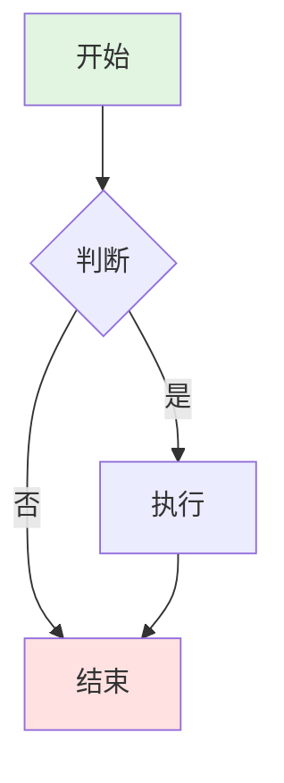
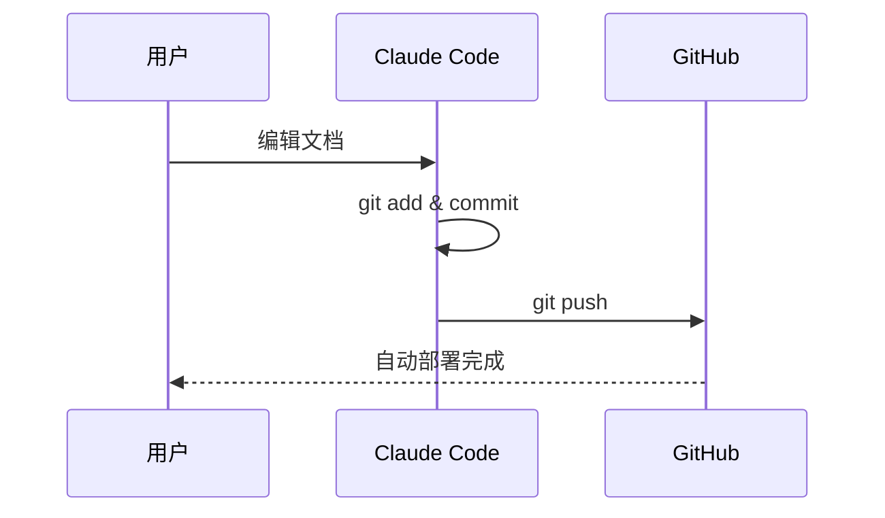
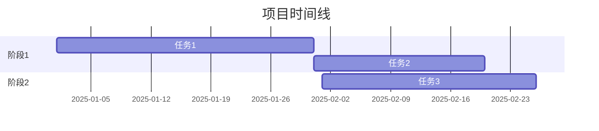
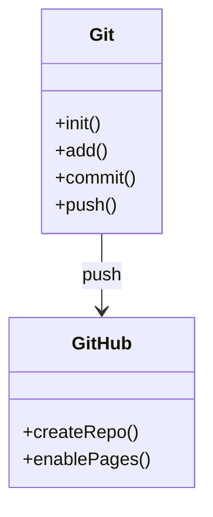

# Mermaid 图表配置说明

> 如何让 GitHub Pages 正确显示 Mermaid 流程图

---

## 🤔 问题原因

### 为什么 Mermaid 图表不显示？

在 Markdown 中写的 Mermaid 代码块：

```markdown
```mermaid
graph LR
    A --> B
`` `
```

在 GitHub 仓库中可以正常显示（GitHub 原生支持），但在 GitHub Pages 网站上**无法显示**。

### 技术原因

| 环境 | Markdown 处理器 | Mermaid 支持 | 结果 |
|------|---------------|-------------|------|
| **GitHub 仓库页面** | GitHub 自定义渲染器 | ✅ 原生支持 | 正常显示 |
| **GitHub Pages** | Jekyll (kramdown) | ❌ 不支持 | 显示为代码块 |

**核心问题**：GitHub Pages 使用 Jekyll 处理 Markdown，而 Jekyll 默认不会将 Mermaid 代码块转换为可交互的图表。

---

## ✅ 解决方案

我们添加了 **Mermaid.js 库**来自动渲染图表。

### 方案对比

| 方案 | 优点 | 缺点 | 推荐度 |
|------|------|------|--------|
| **CDN 引入** | 简单、无需构建 | 依赖外部CDN | ⭐⭐⭐⭐⭐ |
| 本地文件 | 离线可用 | 需要维护版本 | ⭐⭐⭐ |
| VitePress | 功能强大、美观 | 配置复杂、需构建 | ⭐⭐⭐⭐ |
| Docusaurus | 企业级、功能全 | 学习成本高 | ⭐⭐⭐ |

我们选择了 **CDN 方案**，最简单直接。

---

## 📁 配置文件说明

### 1. `_layouts/default.html`

这是网站的**默认布局模板**，所有 Markdown 页面都会使用这个布局。

```html
<!-- 关键部分：引入 Mermaid.js -->
<script type="module">
    import mermaid from 'https://cdn.jsdelivr.net/npm/mermaid@10/dist/mermaid.esm.min.mjs';
    mermaid.initialize({
        startOnLoad: true,        // 页面加载时自动渲染
        theme: 'default',         // 主题：default/dark/forest/neutral
        flowchart: {
            useMaxWidth: true,    // 响应式宽度
            htmlLabels: true,     // 支持HTML标签
            curve: 'basis'        // 连线样式
        }
    });
</script>
```

**工作原理**：
1. 页面加载时，Mermaid.js 自动扫描所有 `<pre class="mermaid">` 或 `<code class="language-mermaid">` 标签
2. 将代码解析为 SVG 图形
3. 替换原来的代码块

**其他功能**：
- GitHub 风格的样式（表格、代码块、链接等）
- 响应式设计（移动端友好）
- 自动添加"返回首页"链接
- 可选的 GitHub Fork 角标

### 2. `_config.yml`

Jekyll 的**主配置文件**。

```yaml
# 站点基本信息
title: 开发指南集合
description: Development Guides Collection
lang: zh-CN

# Markdown 处理
markdown: kramdown          # GitHub Pages 默认处理器
kramdown:
  input: GFM               # GitHub Flavored Markdown
  syntax_highlighter: rouge # 代码高亮

# 插件
plugins:
  - jekyll-relative-links  # 自动处理相对链接
  - jekyll-titles-from-headings  # 从标题生成页面标题
  - jekyll-github-metadata # 获取GitHub仓库信息

# 排除文件（不发布到网站）
exclude:
  - .claude/
  - .git/
  - "*.tmp"
```

**关键配置解释**：

| 配置项 | 作用 | 说明 |
|--------|------|------|
| `markdown: kramdown` | Markdown 处理器 | GitHub Pages 默认选择 |
| `input: GFM` | 支持 GitHub 风格 | 表格、任务列表、删除线等 |
| `jekyll-relative-links` | 相对链接处理 | `[文档](文档.md)` 自动转为正确链接 |
| `exclude` | 排除文件 | 不会发布到网站 |

### 3. `index.md`

网站**首页**，替代 README.md。

```markdown
---
layout: default   # 使用 default.html 布局
title: 开发指南集合
---

# 开发指南集合
...
```

**为什么需要 index.md？**
- README.md 在 GitHub 仓库页面显示
- index.md 作为网站首页（更灵活、可自定义）
- 可以指定不同的布局和样式

---

## 🎨 Mermaid 主题定制

### 修改主题

编辑 `_layouts/default.html` 中的 `theme` 参数：

```javascript
mermaid.initialize({
    startOnLoad: true,
    theme: 'default',  // 可选值见下方
    // ...
});
```

### 可用主题

| 主题名称 | 效果 | 适用场景 |
|---------|------|---------|
| `default` | 蓝绿配色 | 通用场景 |
| `dark` | 深色背景 | 深色模式网站 |
| `forest` | 绿色系 | 自然、环保主题 |
| `neutral` | 灰色系 | 正式文档 |
| `base` | 最简风格 | 需要自定义样式时 |

### 自定义配色

```javascript
mermaid.initialize({
    startOnLoad: true,
    theme: 'base',
    themeVariables: {
        primaryColor: '#ff6b6b',      // 主色调
        primaryTextColor: '#fff',     // 文字颜色
        primaryBorderColor: '#ff6b6b', // 边框颜色
        lineColor: '#333',            // 连线颜色
        secondaryColor: '#4ecdc4',    // 次要颜色
        tertiaryColor: '#ffe66d'      // 第三颜色
    }
});
```

---

## 📝 Mermaid 语法速查

### 流程图 (Flowchart)



**代码**：
```markdown
```mermaid
graph TB
    A[开始] --> B{判断}
    B -->|是| C[执行]
    B -->|否| D[结束]
    C --> D

    style A fill:#e1f5e1
    style D fill:#ffe1e1
`` `
```

**节点形状**：
- `[矩形]`
- `(圆角矩形)`
- `{菱形}`
- `([圆柱])`
- `[[子程序]]`
- `[(数据库)]`

**连线样式**：
- `-->` 实线箭头
- `-.->` 虚线箭头
- `==>` 粗线箭头
- `--文字-->` 带文字的箭头

### 时序图 (Sequence Diagram)



### 甘特图 (Gantt Chart)



### 类图 (Class Diagram)



---

## 🔍 验证和测试

### 本地测试（可选）

如果想在本地预览 Jekyll 网站：

```bash
# 1. 安装 Jekyll
gem install bundler jekyll

# 2. 创建 Gemfile
cat > Gemfile <<EOF
source "https://rubygems.org"
gem "github-pages", group: :jekyll_plugins
EOF

# 3. 安装依赖
bundle install

# 4. 启动本地服务器
bundle exec jekyll serve

# 5. 访问
# 浏览器打开: http://localhost:4000
```

### 在线测试

1. **推送代码后等待 2-3 分钟**
   ```bash
   git push
   ```

2. **访问网站**
   ```
   http://mistprism.cloud
   ```

3. **打开开发者工具检查**
   - Chrome: F12 → Console
   - 查看是否有 Mermaid 相关错误
   - 检查 SVG 元素是否正确生成

4. **验证 Mermaid 加载**
   - 在 Console 输入：
     ```javascript
     typeof mermaid
     ```
   - 应该返回 `"object"` 而不是 `"undefined"`

---

## 🐛 常见问题

### Q1: 推送后图表仍不显示

**可能原因**：
1. GitHub Pages 构建需要时间（2-3 分钟）
2. 浏览器缓存了旧版本

**解决方法**：
```bash
# 1. 检查 GitHub Pages 构建状态
gh run list --repo chituhouse/dev-guides

# 2. 强制刷新浏览器
# Mac: Cmd + Shift + R
# Windows: Ctrl + Shift + R

# 3. 清除浏览器缓存
# Chrome: 设置 → 隐私设置 → 清除浏览数据
```

### Q2: 图表显示但布局混乱

**可能原因**：图表过大或节点文字太长

**解决方法**：

```javascript
// 在 _layouts/default.html 中调整配置
mermaid.initialize({
    startOnLoad: true,
    theme: 'default',
    flowchart: {
        useMaxWidth: false,  // 改为 false，不限制宽度
        htmlLabels: true,
        curve: 'basis',
        nodeSpacing: 50,     // 增加节点间距
        rankSpacing: 50      // 增加层级间距
    }
});
```

### Q3: 某些图表语法不支持

**可能原因**：Mermaid 版本问题

**解决方法**：

```html
<!-- 更新到最新版本 -->
<script type="module">
    import mermaid from 'https://cdn.jsdelivr.net/npm/mermaid@latest/dist/mermaid.esm.min.mjs';
    // ...
</script>

<!-- 或指定具体版本 -->
<script type="module">
    import mermaid from 'https://cdn.jsdelivr.net/npm/mermaid@10.9.0/dist/mermaid.esm.min.mjs';
    // ...
</script>
```

### Q4: CDN 加载失败

**可能原因**：网络问题或 CDN 不可用

**解决方法1 - 使用国内 CDN**：

```html
<!-- 使用 unpkg.com -->
<script type="module">
    import mermaid from 'https://unpkg.com/mermaid@10/dist/mermaid.esm.min.mjs';
    // ...
</script>
```

**解决方法2 - 下载到本地**：

```bash
# 1. 下载 Mermaid.js
curl -o assets/mermaid.min.js https://cdn.jsdelivr.net/npm/mermaid@10/dist/mermaid.min.js

# 2. 修改 _layouts/default.html
<script src="/assets/mermaid.min.js"></script>
<script>
    mermaid.initialize({ startOnLoad: true });
</script>
```

### Q5: 图表颜色与网站风格不搭配

**解决方法**：自定义主题变量

```javascript
mermaid.initialize({
    startOnLoad: true,
    theme: 'base',
    themeVariables: {
        // 根据网站配色调整
        primaryColor: '#你的主色调',
        primaryTextColor: '#你的文字颜色',
        primaryBorderColor: '#你的边框颜色',
        lineColor: '#你的连线颜色',
        background: '#你的背景色'
    }
});
```

---

## 🚀 进阶用法

### 1. 交互式图表

```javascript
mermaid.initialize({
    startOnLoad: true,
    securityLevel: 'loose',  // 允许交互
    flowchart: {
        htmlLabels: true,
        useMaxWidth: true
    }
});
```

在 Mermaid 代码中添加点击事件：


### 2. 动态生成图表

在页面中添加按钮，动态插入 Mermaid 代码：

```html
<button onclick="renderDiagram()">生成图表</button>
<div id="diagram"></div>

<script>
function renderDiagram() {
    const code = `
        graph LR
            A --> B
    `;
    document.getElementById('diagram').innerHTML =
        '<pre class="mermaid">' + code + '</pre>';
    mermaid.init(undefined, document.querySelectorAll('.mermaid'));
}
</script>
```

### 3. 导出图表为图片

```javascript
// 在浏览器控制台执行
const svg = document.querySelector('.mermaid svg');
const serializer = new XMLSerializer();
const svgString = serializer.serializeToString(svg);
const blob = new Blob([svgString], {type: 'image/svg+xml'});
const url = URL.createObjectURL(blob);

// 下载
const a = document.createElement('a');
a.href = url;
a.download = 'diagram.svg';
a.click();
```

---

## 📚 相关资源

- **Mermaid 官方文档**: https://mermaid.js.org/
- **Mermaid Live Editor**: https://mermaid.live/ - 在线测试工具
- **Jekyll 文档**: https://jekyllrb.com/docs/
- **GitHub Pages 文档**: https://docs.github.com/en/pages
- **Kramdown 语法**: https://kramdown.gettalong.org/syntax.html

---

## 📊 配置总结

### 需要的文件

```
项目根目录/
├── _layouts/
│   └── default.html      # ✅ 必需 - 包含 Mermaid.js
├── _config.yml           # ✅ 必需 - Jekyll 配置
├── index.md              # ⭐ 推荐 - 网站首页
├── CNAME                 # ✅ 必需 - 自定义域名
└── *.md                  # 其他文档
```

### 配置检查清单

- [x] 创建 `_layouts/default.html` 并引入 Mermaid.js
- [x] 创建 `_config.yml` 配置 Jekyll
- [x] 创建 `index.md` 作为首页
- [x] 推送到 GitHub
- [x] 等待 GitHub Pages 构建
- [x] 访问网站验证图表显示

---

## ✅ 完成！

现在你的 GitHub Pages 网站已经完美支持 Mermaid 图表了！

访问 **http://mistprism.cloud** 查看效果。

---

*配置日期: 2025-11-18*
*Mermaid 版本: 10.x*
*Jekyll 版本: GitHub Pages 默认*
